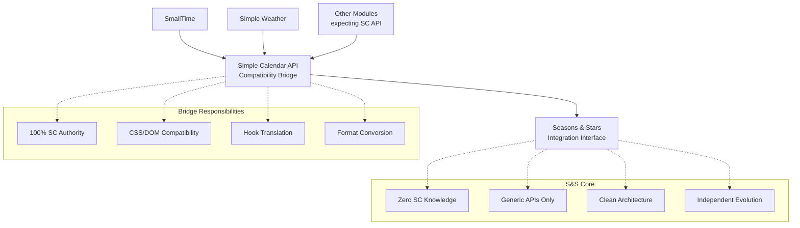

# Simple Calendar Compatibility Bridge

A Foundry VTT module that provides Simple Calendar API compatibility for modern calendar modules like **Seasons & Stars**.

## Overview

This module acts as a bridge between modules that expect the Simple Calendar API and modern calendar implementations. The bridge provides **100% Simple Calendar compatibility** while maintaining complete separation from the underlying calendar system. This allows calendar modules to focus on their core functionality without needing Simple Calendar-specific code.

## Features

- **Complete API Coverage**: Implements the full Simple Calendar API surface (50+ methods)
- **Automatic Detection**: Uses S&S Integration Interface for seamless integration
- **Hook Bridging**: Translates between S&S hooks and Simple Calendar hook formats
- **CSS/DOM Compatibility**: Dynamically adds all required Simple Calendar CSS classes and DOM structure
- **Zero Configuration**: Just install and it works
- **Clean Architecture**: Complete separation of concerns between calendar and compatibility layers
- **Robust Error Handling**: Graceful degradation with comprehensive fallbacks

## Supported Calendar Modules

- ✅ **Seasons & Stars v2.0+** - Full support via Integration Interface
- ✅ **Seasons & Stars v1.x** - Legacy support via wrapper
- 🔄 **Other calendar modules** - Extensible architecture for future integrations

## Compatible Modules

This bridge enables the following modules to work with modern calendar systems:

### ✅ **Fully Tested & Supported**
- **SmallTime** - Time display widget with complete integration
- **Simple Weather** - Complete weather system with all features:
  - Sidebar button integration on calendar widgets
  - Weather data storage in calendar notes (when "Store weather in Simple Calendar notes" is enabled)
  - Season-based weather using calendar season information
  - All attachment modes (attached/detached to calendar)

### 🔄 **Expected to Work**
- **Calendar/Weather** - Advanced weather systems
- Any module expecting Simple Calendar API

### **Simple Weather Feature Support**

All Simple Weather features work seamlessly:

- ✅ **Weather Generation** - Full climate and season-based weather
- ✅ **Temperature Display** - Celsius/Fahrenheit with season adjustments
- ✅ **Calendar Integration** - Sidebar buttons on all calendar widgets
- ✅ **Weather Persistence** - Complete note storage system for historical weather
- ✅ **Manual Weather Control** - All weather override capabilities
- ✅ **Effect Integration** - Audio/visual weather effects
- ✅ **Scene Integration** - Weather overlay on scenes

## Installation

1. Install your preferred calendar module (e.g., Seasons & Stars)
2. Install this compatibility bridge module
3. **Do NOT** install Simple Calendar (this replaces it)
4. Activate both modules in Foundry

## Usage

The bridge works automatically - no configuration needed! Once installed:

1. The bridge detects your calendar module
2. Exposes the Simple Calendar API (`window.SimpleCalendar`)
3. Translates all hooks and method calls
4. Other modules work seamlessly

## For Developers

### Architecture Overview

The bridge uses a **Integration Interface** pattern rather than provider abstraction. This provides cleaner separation and better error handling.

### Adding Calendar Module Support

To add support for your calendar module, implement the S&S Integration Interface pattern:

1. **Expose Integration Interface** in your calendar module:

```typescript
// In your calendar module's main setup
Hooks.once('ready', () => {
  (game as any).yourCalendar = {
    integration: {
      isAvailable: true,
      version: '2.1.0',
      api: {
        getCurrentDate(): CalendarDate { /* implementation */ },
        worldTimeToDate(timestamp: number): CalendarDate { /* implementation */ },
        dateToWorldTime(date: CalendarDate): number { /* implementation */ },
        formatDate(date: CalendarDate, options?: any): string { /* implementation */ },
        getActiveCalendar(): Calendar { /* implementation */ },
        // ... other API methods
      },
      widgets: {
        main: yourMainWidget,
        mini: yourMiniWidget,
        grid: yourGridWidget
      },
      hooks: {
        onDateChanged(callback: Function): void { /* implementation */ }
      }
    }
  };
});
```

2. **Add Bridge Detection** in the bridge `main.ts`:

```typescript
// Add after Seasons & Stars detection
const yourCalendarIntegration = (game as any).yourCalendar?.integration;
if (yourCalendarIntegration?.isAvailable) {
  return new YourCalendarIntegrationProvider(yourCalendarIntegration);
}
```

3. **Create Integration Provider** for your calendar:

```typescript
export class YourCalendarIntegrationProvider implements CalendarProvider {
  constructor(private yourCalendar: YourCalendarIntegration) {}
  
  // Implement CalendarProvider interface using yourCalendar.api methods
}
```

### API Coverage

The bridge implements the complete Simple Calendar API:

- **Core Methods**: `timestamp()`, `timestampToDate()`, `getCurrentDate()`
- **Time Advancement**: `advanceDays()`, `addMonths()`, `setTime()`
- **Formatting**: `formatDateTime()`, `dateToTimestamp()`
- **Note Management**: `getNotesForDay()`, `addNote()`, `removeNote()` with full flag support
- **Icon Constants**: `Icons.Fall`, `Icons.Winter`, `Icons.Spring`, `Icons.Summer`
- **SmallTime Integration**: Clock controls, display formatting
- **Simple Weather Integration**: 
  - Sidebar buttons on all calendar widgets
  - Complete weather data persistence in calendar notes
  - Season icon mapping for weather generation
  - Sunrise/sunset times (configurable)
- **Hook System**: All Simple Calendar hooks with proper data translation

## Architecture

The new architecture achieves complete separation of concerns:



### Key Architectural Principles

- **Bridge Authority**: Bridge handles 100% of Simple Calendar compatibility requirements
- **Clean Separation**: Seasons & Stars has zero Simple Calendar knowledge  
- **Generic APIs**: S&S provides reusable APIs for any calendar integration
- **Format Translation**: Bridge handles all data format conversions (0-based ↔ 1-based)
- **CSS/DOM Authority**: Bridge dynamically adds all required Simple Calendar classes
- **Hook Translation**: Bridge translates between S&S and Simple Calendar hook formats

## Benefits

### For Users
- **Compatibility**: Use any calendar module with any calendar-dependent module
- **Choice**: Switch between calendar modules without losing functionality
- **Simplicity**: One bridge module handles all compatibility

### For Developers
- **Focused Development**: Calendar modules focus on calendar functionality
- **Reduced Maintenance**: No need to maintain Simple Calendar compatibility in each module
- **Extensibility**: Easy to add support for new calendar modules

## Troubleshooting

### Module Not Working?

1. Check that Simple Calendar is **NOT** installed (conflicts)
2. Verify your calendar module is active and supported
3. Check browser console for bridge initialization messages
4. Ensure module load order: Calendar module → Bridge → Dependent modules

### Missing Features?

The bridge implements the complete Simple Calendar API. If something doesn't work:

1. Check if your calendar module supports the required features
2. Report issues with specific module combinations
3. Provide console logs and error messages

## Contributing

Contributions welcome! Areas of interest:

- Additional calendar module providers
- Enhanced API coverage
- Better error handling
- Documentation improvements

## License

MIT License - see LICENSE file for details.

## Credits

- Inspired by the original Simple Calendar module
- Built for the Foundry VTT community
- Designed to work with Seasons & Stars and future calendar modules